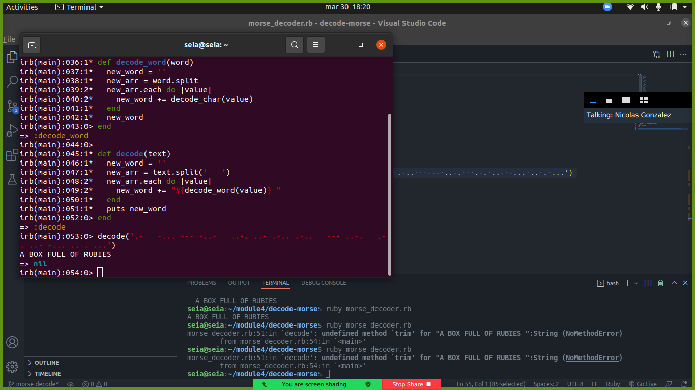

# Morse decoder

A simple ruby project that allows the user to decode any morse message

## Built With

- Ruby
- Rubocop

## Getting Started

To get a local copy up and running follow these simple example steps.

### Prerequisites

Run git clone https://github.com/lisandroseia/decode-morse.git to get a local copy of the project

### Usage

Run "ruby decode-morse" to get the output

## Authors

👤 **Nicolas**

Platform | Badge |
 --- | --- |
 **GitHub**  | [@Nicolaswg](https://github.com/Nicolaswg)
 **LinkdIn** | [LinkedIn](https://www.linkedin.com/in/nicolas-gonzalez-8623461a0/)

👤 **Lisandro Seia**

Platform | Badge |
 --- | --- |
 **GitHub**  | [@lisandroseia](https://github.com/lisandroseia)
 **LinkdIn** | [LinkedIn](https://www.linkedin.com/in/lisandro-seia-295120225/)

## 🤝 Contributing

Contributions, issues, and feature requests are welcome!

Feel free to check the [issues page](../../issues/).

## Show your support

Give a ⭐️ if you like this project!

## 📝 License

This project is [MIT](./MIT.md) licensed.
